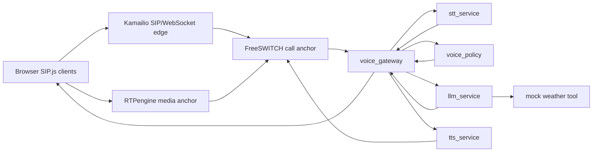

# Voice AI Telecom Demo

This repository is a local proof of concept for a real-time voice AI platform:
browser WebRTC calls enter a SIP edge, are anchored in FreeSWITCH, streamed to
Python services for STT/LLM/TTS, and played back into the live call.

The POC focuses on:

- **Telco-shaped integration**: Kamailio, RTPengine, and FreeSWITCH are in the
  call path so the AI layer is shown alongside recognisable SIP/WebRTC/RTP
  components. That makes client-infrastructure integration, media anchoring,
  routing, and audio-quality concerns concrete instead of abstract.
- **Semantic and policy turn-taking**: STT endpointing is treated as a candidate
  boundary, not the whole decision. A local semantic/policy layer separates
  silence, incomplete thoughts, backchannels, side-talk, true interruptions,
  risky actions, and normal user requests.
- **Clarification for underspecified questions**: incomplete question fragments
  such as `Can I ask why?` are held briefly for a continuation, then routed to a
  targeted clarification prompt instead of a generic acknowledgement or a
  premature LLM answer.
- **More natural speech orchestration**: the gateway can pause for real
  interruptions, suppress accidental backchannels, offer a low-pressure
  check-in for repeated hesitation-style interjections, and speak short
  filler/progress utterances instead of leaving every long wait silent.
- **Assistant and peer-to-peer value**: extension `7000` demonstrates a
  voice-agent call, while extension `7100` demonstrates the same telco path
  adding value to a two-party translated call.
- **Delivery-aware LLM context**: the gateway tracks what assistant text was
  generated, what was likely spoken, and what may have been unheard. After an
  interruption, that delivery context is passed into the next LLM turn so the
  assistant can continue naturally instead of assuming the whole answer was
  heard.
- **Latency and observability ownership**: the browser shows structured events,
  turn-flow state, latency counters, tool progress, TTS cancellation, and WebRTC
  quality so bottlenecks are visible during review.
- **Quality assurance with machine learning**: the semantic policy scenarios,
  structured event stream, and browser replay fixtures form the beginnings of a
  feedback mechanism that could use ML to discover suspicious behaviours,
  cluster similar failures, compare live decisions with offline evaluators, and
  turn confirmed findings into new fixtures or semantic-interpreter training
  data.

## 5-Minute Reviewer Path

Use this README as the primary path before opening the larger docs.

1. Skim the POC concepts above, the Mermaid diagram, and the service table.
2. Before a live demo, run `./setup.sh`, set `OPENAI_API_KEY` in `.env`, and
   keep optional local/debug toggles off unless the walkthrough calls for them:

   ```text
   AI_OFFLINE_FALLBACK=0
   STT_FALLBACK_ON_UPSTREAM_ERROR=0
   LLM_FALLBACK_ON_UPSTREAM_ERROR=0
   LLM_ENABLE_MOCK_WEATHER_TOOL=0
   VOICE_GATEWAY_ALLOW_WILDCARD_EVENTS=0
   ```

   Use `docker compose config --quiet` for Compose validation so local secret
   values are not printed.
3. Run local checks when you need code confidence:

   ```bash
   uv sync
   uv run ruff check .
   uv run pytest
   docker compose config --quiet
   uv run python evals/voice_policy/run_voice_policy_evals.py --reports-dir /tmp/voice-ai-evals
   uv run python evals/multilingual/run_multilingual_evals.py --reports-dir /tmp/voice-ai-multilingual
   ```

   The voice policy report is written to:

   ```text
   /tmp/voice-ai-evals/voice_policy_eval_report.md
   ```

4. For an end-to-end demo, [run the Docker stack](#run-the-docker-demo), then
   follow the [Demo Walkthroughs](#demo-walkthroughs).

## Runtime Flow



Audio and call-control messages travel through the telecom components. A
separate event stream sends the browser a live view of the call: transcripts,
assistant state, latency, interruptions, tool activity, and audio quality.

| Area | Role in the demo |
| --- | --- |
| `web_client/` | Static SIP.js clients for the assistant call, translation peer, trace replay, and browser observability panel. |
| `kamailio/` | SIP/WebSocket ingress, registration, and routing into the local voice stack. |
| `rtpengine/` | Local WebRTC/RTP media anchoring between the browser and SIP media path. |
| `freeswitch/` | Call anchor, dialplan for `7000` and `7100`, outbound ESL initiator, and local TTS playback point. |
| `services/voice_gateway/` | Outbound ESL listener, media WebSocket endpoint, STT/LLM/TTS orchestration, policy routing, barge-in handling, delivery tracking, and event publication. |
| `services/stt_service/` | Streaming speech-to-text using OpenAI when configured, with deterministic local fallback for demos. |
| `services/llm_service/` | Voice-optimised responses, translation, and mock weather tool orchestration. |
| `services/tts_service/` | FreeSWITCH `speak` command gateway using local Piper voices with fallback configuration. |
| `voice_policy/` and `evals/voice_policy/` | Semantic frames, policy decisions, and YAML regression scenarios for voice judgement. |

## Run The Docker Demo

Install Python dependencies and create local env files:

```bash
uv sync
./setup.sh
```

`setup.sh` creates ignored local env files and fills local-only DB and
FreeSWITCH ESL secrets. `.env` is copied from `.env.example` and is the
reviewer-facing Docker Compose override file. `conf/env` is generated from the
same template with shell-safe quoting because the telecom entrypoints source it
at runtime.

Docker Compose loads `conf/env` as a baseline where needed, then explicit
Compose `environment` entries interpolated from `.env` or the parent shell win
for reviewer-facing toggles. Do not duplicate the same setting in both files.
If setup keeps an old generated file and warns about missing keys, regenerate:

```bash
./setup.sh --force
```

The default mode is live provider mode and fails loudly if `OPENAI_API_KEY` is
missing:

```text
AI_OFFLINE_FALLBACK=0
STT_FALLBACK_ON_UPSTREAM_ERROR=0
LLM_FALLBACK_ON_UPSTREAM_ERROR=0
LLM_ENABLE_MOCK_WEATHER_TOOL=0
```

Set `OPENAI_API_KEY` in `.env` before starting the stack. For an offline demo,
set `AI_OFFLINE_FALLBACK=1` in `.env`. Enable upstream fallback only when you
explicitly want a local fallback after provider errors:

```text
STT_FALLBACK_ON_UPSTREAM_ERROR=1
LLM_FALLBACK_ON_UPSTREAM_ERROR=1
```

Telecom diagnostics are quiet by default. For local SIP/body dumps or debug
media logs, enable these explicit flags in `.env` only while debugging:

```text
KAMAILIO_DEBUG_LEVEL=2
KAMAILIO_SIP_BODY_LOGGING=1
KAMAILIO_SIPDUMP_ENABLE=1
KAMAILIO_SIPTRACE_ENABLE=1
FREESWITCH_CONSOLE_LOGLEVEL=debug
FREESWITCH_CORE_LOGLEVEL=debug
RTPENGINE_LOG_LEVEL=7
```

`conf/env` should normally be treated as generated runtime input. Edit `.env`
for `AI_OFFLINE_FALLBACK`, `LLM_ENABLE_MOCK_WEATHER_TOOL`, Kamailio debug
toggles, RTPengine log settings, FreeSWITCH loglevels, wildcard event controls,
delivery resume delay, and local STT fixture settings such as
`LOCAL_STT_FINAL_TEXT` and `LOCAL_STT_CONFIDENCE`.

Start the stack:

```bash
docker compose up -d
```

Open the assistant client:

```text
http://127.0.0.1:8080/call/call.html
```

Click **Call AI agent**, allow microphone access, speak to the agent, and keep
the voice session panel visible. Stop the stack with:

```bash
docker compose down
```

The local images intentionally include diagnostics such as `sngrep`, `tcpdump`,
and related network tools for reviewer troubleshooting inside the Docker
network. FreeSWITCH ESL is available only on the Compose network by default; it
is not host-published unless you add a port mapping yourself. The FreeSWITCH
`mod_audio_stream` build is pinned by default; override
`MOD_AUDIO_STREAM_REF` as a local build arg only when deliberately testing a
different upstream ref.

## Demo Walkthroughs

These are the shortest checks for the claims in the opening section. They
assume the Docker stack is running and the assistant client is open:

```text
http://127.0.0.1:8080/call/call.html
```

Keep the browser panel visible. It is the easiest way to see what the system
heard, what it decided, how long each step took, and whether the WebRTC media
looks healthy.

### 1. Prove The Voice Agent Works End To End

Click **Call AI agent**, allow microphone access, and ask:

```text
What can you help me with?
```

This validates the basic claim: a browser call can enter the local telecom
stack, reach the AI services, and play an answer back into the live call. The
pass signal is simple: you hear the assistant reply, and the browser panel moves
through listening, thinking, speaking, latency, and audio-quality updates.

### 2. Check That Half-Finished Questions Are Not Answered Too Early

Say:

```text
Can I ask why
```

Then stay quiet. The assistant should ask what you are asking why about instead
of inventing an answer. Repeat the check, but quickly add:

```text
the sky is blue.
```

The assistant should answer the combined question. This validates the semantic
and policy turn-taking claim: the system treats silence as a clue, not as proof
that the user finished a complete thought.

### 3. Check That Small Acknowledgements Do Not Derail The Call

Ask for a longer answer:

```text
Why are cars so fast? Give me a detailed explanation.
```

While the assistant is speaking, say:

```text
OK.
```

A single acknowledgement should not start a new user turn. If you say `OK`
again during the same answer, the assistant should briefly check in with
`Yes?`. This validates the claim that backchannels and real interruptions are
handled differently.

### 4. Check That Real Interruptions Stop Speech And Recover

Ask the same longer question again. While the assistant is speaking, say:

```text
Wait.
```

The assistant should stop speaking and ask `Yes?`. If you stay silent after the
check-in, it should continue from the likely unheard part of the answer. If you
say `No, carry on.`, live AI mode should continue naturally without assuming you
heard the full interrupted answer. This validates the delivery-aware context and
more natural speech-orchestration claims.

### 5. Check External-Service Waiting Behaviour

Ask:

```text
What's the weather in Lisbon tomorrow?
```

The assistant should avoid a long dead pause while the mock weather lookup runs,
then answer with the result. The browser panel should show tool progress and
latency updates. This validates the claim that long waits are observable and can
be filled with short progress speech.

This optional check requires `LLM_ENABLE_MOCK_WEATHER_TOOL=1` in `.env` before
the stack starts. If you do not have an `OPENAI_API_KEY`, also set
`AI_OFFLINE_FALLBACK=1` in `.env` so service readiness can pass. If the mock
weather tool is disabled, weather questions behave like ordinary LLM prompts.

### 6. Prove The Same Stack Adds Value To A Two-Party Call

Open the guided translation page:

```text
http://127.0.0.1:8080/translation-demo/translation_demo.html
```

Click **Start English to French**. When the page says it is live, say:

```text
Hello Bob, can you hear the translation?
```

The page should show an English source transcript, French translated text, a
queued spoken response, and inbound audio for Bob. Then reset the demo, click
**Start French to English**, and say:

```text
Bonjour Bob, est-ce que tu entends la traduction ?
```

The page should show the same flow in the other direction. This validates the
claim that the platform is not only a one-ended voice-agent demo. Offline
fallback mode proves the call flow with tagged text; live AI mode is needed to
judge translation quality.

On the guided page, Bob's embedded receiver sends a silent media track so the
laptop microphone is only attached to Person A. Bob's speaker monitor is audible
by default so you can hear the translated audio on the same computer; add
`?mute_receiver_audio=1` if you want to disable that local monitor.

### 7. Check That Review Evidence Is Visible

During any call above, look at these browser-panel areas:

- **Turn flow** should change as the user speaks, the assistant thinks, and TTS
  plays.
- **Latency** should fill in timing numbers for the current turn.
- **Audio quality** should show WebRTC signal, jitter, loss, and RTT.
- **Event timeline** should show what happened in order.
- **Copy debug** should capture the visible review bundle.

This validates the observability claim: a reviewer can see bottlenecks and
behavioural decisions without reading service logs first.

### 8. Check Repeatable Policy Evidence

For repeatable policy checks, run:

```bash
uv run python evals/voice_policy/run_voice_policy_evals.py --reports-dir /tmp/voice-ai-evals
```

Open `/tmp/voice-ai-evals/voice_policy_eval_report.md`. This validates the
quality-assurance claim at POC level: interesting behaviours can be reviewed and
converted into repeatable fixtures.

The multilingual runner writes to `/tmp/voice-ai-multilingual` by default and
checks route metadata and deterministic turn-taking contracts. It is not a
translation-quality benchmark.

## End-To-End Assistant Flow

For the full architecture notes, see [Architecture](docs/architecture.md). The
assistant flow on extension `7000` is:

1. `call/call.html` registers over WebSocket and calls `sip:7000@voice.local`.
2. Kamailio receives the WebRTC SIP leg and routes the call.
3. RTPengine anchors browser WebRTC media against the SIP/RTP side.
4. FreeSWITCH matches extension `7000` and opens outbound ESL to
   `voice_gateway:5050`.
5. `voice_gateway` answers the call, starts `uuid_audio_stream`, and streams
   audio frames to STT.
6. STT partials and finals become structured events.
7. Final transcripts pass through semantic interpretation and local policy
   before any LLM call.
8. LLM responses and tool progress are streamed back through the gateway.
9. `tts_service` asks FreeSWITCH to speak each response chunk.
10. The browser subscribes to structured metadata events from `voice_gateway`;
    raw audio stays on the media path.

The gateway exposes local event streams at:

```text
ws://127.0.0.1:8000/events?session_id={session_or_call_id}
ws://127.0.0.1:8000/events/{session_or_call_id}
```

Host-published event ports are bound to `127.0.0.1` by default. The empty
`/events` stream is rejected by default and is available only for local
debugging when `VOICE_GATEWAY_ALLOW_WILDCARD_EVENTS=1`.

## Avoiding STT False Positives With Semantic Policy

Most STT systems are good at deciding when audio appears to have stopped. That
is not the same as deciding whether a human finished their conversational turn.
This repo makes that gap explicit:

1. **Semantic interpretation** asks what the user appears to mean: question,
   interruption, incomplete thought, correction, backchannel, side-talk, risky
   action mention, and so on.
2. **Policy decision** asks what the system should do now: wait, respond,
   suppress, cancel TTS and listen, check in, confirm before action, block a
   risky action, or end the call.

Common actions:

| Action | Meaning in practice | Typical trigger |
| --- | --- | --- |
| `WAIT` | Keep listening; do not answer yet. | Partial transcript or incomplete final thought. |
| `CLARIFY` | Ask a short clarification question while keeping the held turn open. | Held question preamble or incomplete wh-question reaches the clarification delay. |
| `RESPOND` | Proceed with normal assistant response flow. | Complete user request addressed to the agent. |
| `SUPPRESS` | Ignore/no-op this utterance in the current moment. | Side-talk, a backchannel while the agent is speaking, or non-interruptible speech. |
| `CANCEL_TTS_AND_LISTEN` | Stop current agent speech and give the floor to the user. | Strong barge-in or interruption while TTS is interruptible. |
| `SOFT_INTERRUPT_CHECKIN` | Pause with a brief check-in prompt. | Repeated hesitation-style or ambiguous short interjection while the agent is speaking. |
| `CONFIRM_BEFORE_ACTION` | Ask for explicit confirmation before a risky action. | Critical intent with low confidence or missing authorisation. |
| `END_CALL` | End the call. | True goodbye without a continuation signal. |

The YAML scenarios under `evals/voice_policy/scenarios/` turn these judgement
calls into repeatable tests.

### ML-Based Production Feedback Discovery

A production feedback loop should not rely only on manual reports or
thumbs-up/thumbs-down labels. The stronger approach is to mine real session
traces for likely failures automatically. An offline feedback pipeline could use
anomaly detection, embedding clustering, outcome-proxy models, and evaluator
model disagreement to surface suspicious turn-taking, semantic-interpretation,
translation, or policy behaviour.

Useful discovery signals include repeated user corrections, immediate barge-ins
after agent responses, policy oscillation, unusual hangups, low confidence,
novel transcript clusters, and disagreement between the live policy and a
stronger offline evaluator. High-confidence discoveries, or discoveries later
confirmed by a reviewer, can be converted into new scenario fixtures and
training data for the semantic interpreter. That keeps behaviour testable and
improvable without burying it in ad hoc conversation code.

## Documentation

- [Architecture](docs/architecture.md)
- [Latency Budget](docs/latency-budget.md)
- [Voice Events](docs/voice-events.md)
- [Voice Policy Layer](docs/voice-policy-layer.md)
- [Gateway Responsibility Map](services/voice_gateway/README.md)
- [Browser Client Map](web_client/README.md)
- [Browser Replay Fixtures](docs/replay-fixtures/README.md)

The ignored upstream reference-doc directories
`docs/freeswitch-docs`, `docs/kamailio-docs`, and `docs/rtpengine-docs` are
optional local-only source material for component work. They are not part of the
tracked submission.

## Before Sharing Or Submitting

Prefer a GitHub link or a clean archive made with `git archive`. Do not zip a
working tree that includes ignored local files such as `.env`, `conf/env`,
`.venv`, caches, `__pycache__`, ignored upstream reference docs, generated
Sphinx/doctree output, or local eval and smoke-test reports.

## Repository Map

```text
.
├── .env.example             # Template copied to .env and used to generate conf/env
├── setup.sh                 # Wrapper for scripts/setup-env.sh
├── pyproject.toml           # Python project and dev dependencies
├── uv.lock                  # Locked Python dependency graph
├── docker-compose.yml       # Local single-node voice stack
├── web_client/              # Static SIP.js/WebRTC clients and observability UI
├── kamailio/                # Local Kamailio image and config
├── rtpengine/               # Local RTPengine image and config
├── freeswitch/              # Local FreeSWITCH image, dialplan, and module config
├── services/                # Python gateway, STT, LLM, TTS, and shared code
├── voice_policy/            # Semantic frame and policy decision layer
├── evals/                   # Voice policy and multilingual eval runners
├── tests/                   # Unit, config, smoke, and fixture tests
├── scripts/                 # Setup and browser smoke helper scripts
└── docs/                    # Tracked architecture notes and replay fixtures
```
