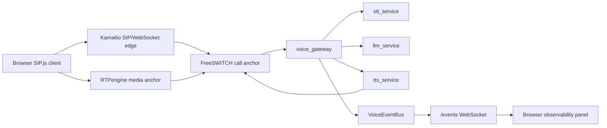

# Architecture

This repository runs a local single-node voice AI proof of concept. It is shaped
like a production voice platform, but it intentionally does not implement high
availability, cross-node dialog recovery, multi-region routing, production TLS
termination, or production secret management.

## Runtime Topology



```text
Browser SIP.js client
  | WebSocket SIP + WebRTC media
  v
Kamailio
  | SIP routing and registration
  v
RTPengine <------ WebRTC/RTP media anchoring
  |
  v
FreeSWITCH
  | outbound ESL + uuid_audio_stream
  v
voice_gateway
  | HTTP/WebSocket clients
  +--> stt_service
  +--> llm_service
  +--> tts_service
```

Raw audio stays on the WebRTC/RTP/media WebSocket path. The event path carries
structured metadata for review and debugging, such as transcripts, policy
decisions, tool progress, TTS timing, cancellation, and latency counters.

The main assistant path uses extension `7000`. The translation path uses
extension `7100` and creates a second parked FreeSWITCH leg to the registered
peer.

## Responsibilities

Kamailio owns SIP/WebRTC ingress, registration, dialog routing, and dispatch to
FreeSWITCH. RTPengine anchors local media conversion for WebRTC calls.
FreeSWITCH owns call control and the media stream attachment point. The Python
gateway owns AI turn orchestration, semantic policy, barge-in cancellation, and
structured voice events.

The STT, LLM, and TTS services are separate processes because they represent
different scaling and failure domains in a production design. In this local repo
they run on one Docker network with fixed local IPs to make SIP/media config
repeatable.

## Observability Boundary

`voice_gateway` publishes structured events for call state, media state, STT,
policy decisions, LLM/tool timing, TTS enqueue timing, and cancellation. The
browser panel consumes those events for demo observability. Raw audio is not
published on the observability channel.

## Mock Agent/Tool Boundary

The local LLM service includes an opt-in mock weather lookup path for local
demos. When `LLM_ENABLE_MOCK_WEATHER_TOOL=1`, weather questions are routed
through a streaming tool-call sequence:

```text
assistant turn -> tool.call_started -> tool.call_progress -> tool.call_completed -> spoken answer
```

The weather data is randomly generated and the wait is deliberately artificial.
The point is not forecast accuracy; it is to make the agent/tool orchestration
boundary, progress speech, and latency accounting visible without external
service dependencies.
